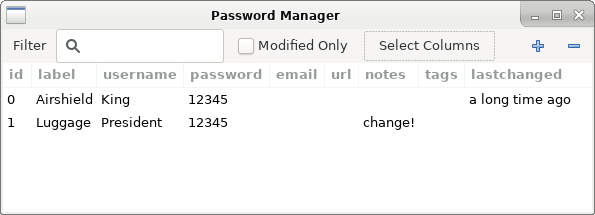

Simple Password Manager
=======================

Simple Password-Manager for storing passwords in an encrypted JSON file. Requires
GPG to be installed and set up, which is called using the `gnupg` library. Passwords
are decrypted, displayed in a simpe UI, and encrypted again when something changes.
Passwords can be tagged and annotated, sorted and filtered.

What this does
--------------
* automatically decrypt and encrypt passwords from a GPG file
* present passwords in a simple UI for searching, filtering, and editing

What this does _not_
--------------------
* store plain-text passwords on the hard drive at any time
* send any type of data over the internet

What you need for this to work
------------------------------
* set up GPG on your computer

Configuration and File Formats
------------------------------
When the program is first executed, it will ask for the user's e-mail address
(used only for knowing for whom to encrypt the passwords) and the location of
the actual password file. The program's configuration is then stored in a JSON
file in `~/.config/t-kuester/pwdmgr`.

The passwords are stored in a separate encrypted JSON file. When decrypted, the
format of the file would be as follows. The file is _never_ stored in this format
on disk by the program, but in case of any problems, you can decrypt it yourself
and edit / repair / salvage it.

    [
        {
            "label": string,
            "username": string,
            "password": string,
            "email": string,
            "url": string,
            "notes": string,
            "tags": string,
            "last_changed": string
        }, ...
    ]

All those attributes are just strings, even the `tags` and `last_changed` date.
Some of those attributes may seem redundant; you do not have to use them all.
In fact, it should be easy to add or remove attributes in the source code.

User Interface
--------------
On the first start, the program will ask for configuration details on the
command line. After that, it will log some information to the command line,
but can otherwise be used entirely through the graphical UI.

* Select a line, then click in a cell to go to "edit mode"; also for copying to
  the clipboard
* Filter: search in all the fields and only show lines that include the text
* Modified Only: only show lines that have been added, edited, or removed;
  new lines will show in green, modified in blue, and removed in red
* Select Columns: select which of the attributes to show/hide; while actually
  not intended, this can also be used to temporarily re-order the columns by
  hiding them and then re-showing them in the desired order
* (Plus): add a new password entry at the bottom of the list
* (Minus): mark the selected password entry for deletion (press again to un-mark)
* (Close): if there have been any changes in the current session, ask the user
  whether to save or discard the changes, then close

Password Generator
------------------
This repository also includes a password generator, that can be used via the
command line or with a simple UI, that can also be invoked from within the
password manager.
